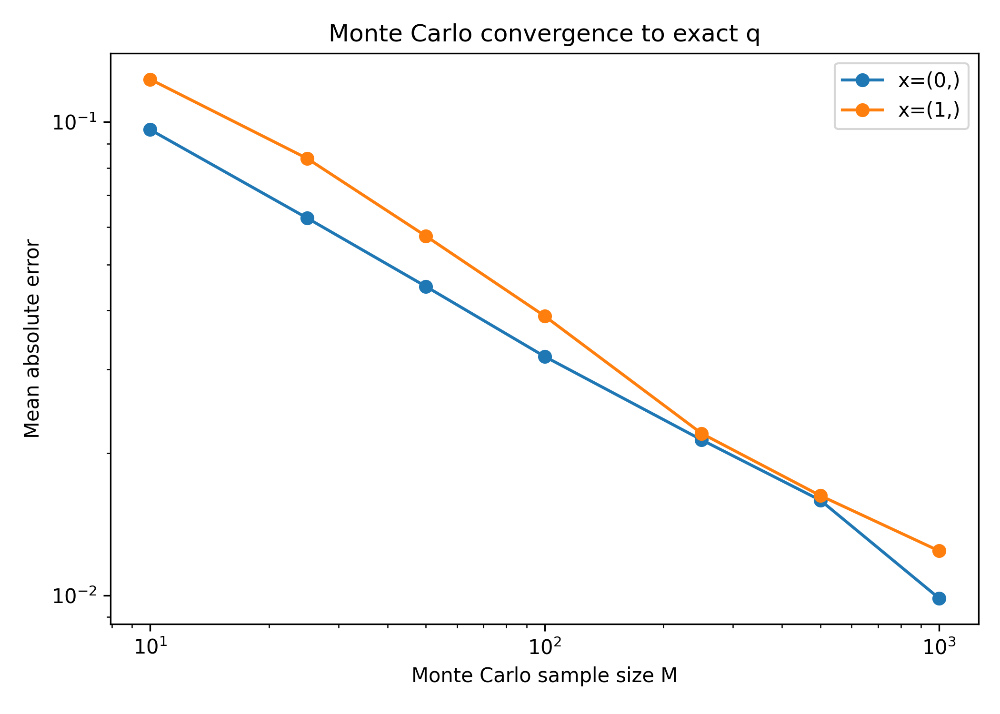
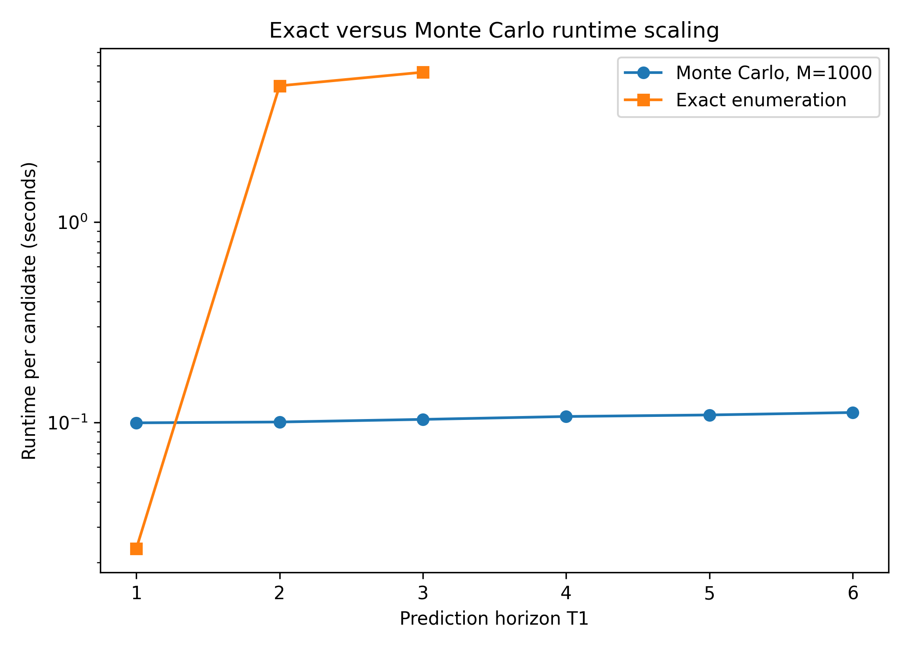
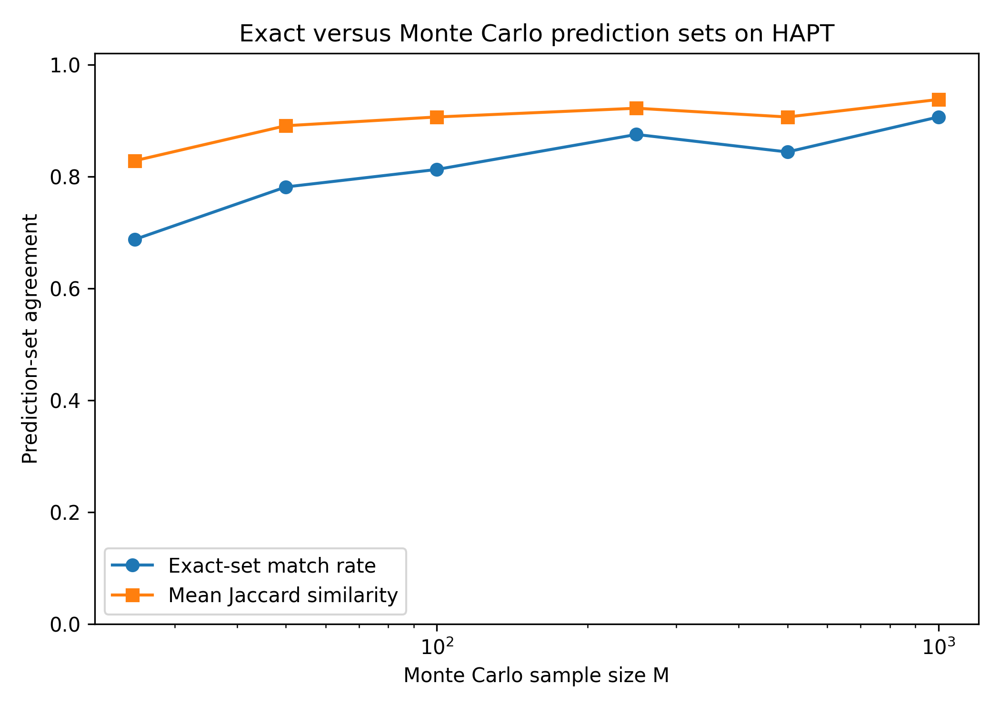

# Monte Carlo Conformal Prediction for Hidden Markov Models

A computational study of Monte Carlo approximation for exhaustive block-permutation conformal prediction in discrete Hidden Markov Models.

**Project report:** [PDF](report/monte_carlo_conformal_hmm.pdf)

## Motivation

The exact HMM conformal prediction procedure of Nettasinghe et al. (2023) computes, for each candidate future hidden-state sequence,

\[
q(x)
=
\frac{1}{|\Pi|}
\sum_{\pi \in \Pi}
\mathbf{1}\{S(\pi) \geq S(I)\}.
\]

Exact evaluation requires exhaustive enumeration over a potentially large block-permutation space.

This project replaces exhaustive enumeration with \(M\) uniformly sampled block arrangements,

\[
\hat q_M(x)
=
\frac{1}{M}
\sum_{m=1}^{M}
\mathbf{1}\{S(\Pi_m) \geq S(I)\},
\]

and studies the resulting statistical-computational tradeoff.

## Main Theoretical Results

For fixed data and candidate \(x\):

- **Unbiasedness**
  \[
  \mathbb{E}[\hat q_M(x)] = q(x).
  \]

- **Conditional variance**
  \[
  \operatorname{Var}(\hat q_M(x))
  =
  \frac{q(x)(1-q(x))}{M}.
  \]

- **Hoeffding concentration**
  \[
  \Pr\left(
  |\hat q_M(x)-q(x)|>\varepsilon
  \right)
  \leq
  2e^{-2M\varepsilon^2}.
  \]

- **Prediction-set stability** depends on the decision margin
  \[
  |q(x)-\alpha|.
  \]

- A Hoeffding-adjusted threshold provides a conservative finite-\(M\) approximation to the exhaustive prediction set.

## Empirical Results

The method was evaluated on simulated discrete HMMs and on the HAPT smartphone activity dataset.

Key findings:

- Monte Carlo score error decreases approximately at the expected \(M^{-1/2}\) rate.
- Prediction-set agreement with exhaustive enumeration improves as \(M\) grows.
- In permutation-heavy simulations, Monte Carlo achieved up to **~54× runtime speedup** over exhaustive enumeration.
- On real HAPT data, conformal-score MAE decreased from **0.044 at \(M=25\)** to **0.008 at \(M=1000\)**.
- Exact prediction-set agreement on HAPT increased from approximately **69% to 91%**.
- Computational gains are largest when \(M\) is substantially smaller than the exhaustive permutation workload.

## Selected Results

### Monte Carlo Convergence



### Runtime Scaling



### Real-Data Prediction-Set Agreement



## Repository Structure

```text
.
├── src/
│   ├── simulation.py
│   ├── conformal.py
│   ├── exact_method.py
│   └── monte_carlo_method.py
├── experiments/
│   ├── exp_00_reproduce_original.py
│   ├── exp_01_mc_convergence.py
│   ├── exp_02_prediction_set_convergence.py
│   ├── exp_03_runtime_scaling.py
│   ├── exp_04_coverage.py
│   └── exp_05_real_data_hapt.py
├── results/
│   ├── figures/
│   └── tables/
├── report/
├── requirements.txt
└── run_all.py